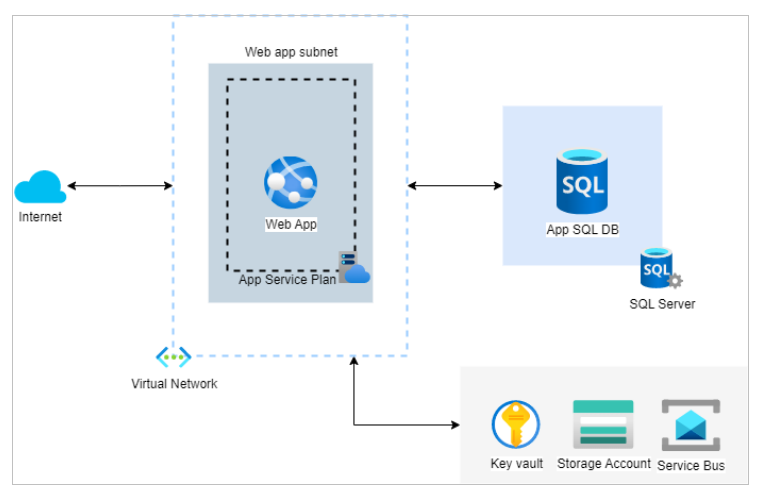

# Introduction

This activity is used to implement the given infrastructure as code:

This is achieved by using Terraform to provision the infrastructure in Azure.

# Branching strategy

The branching strategy used in this repository is based on the [Github Flow](https://guides.github.com/introduction/flow/). This means that the `main` branch is the main branch and all changes are merged into it. The `main` branch is protected and requires a pull request to be merged into it. The pull request must be approved by at least one reviewer before it can be merged.

# Getting Started

This project divides the infrastructure into global resources (used by all environments) like resource groups or storage accounts. There are also modules and an staging environment.

1. Create the global resources using the terraform `terraform apply` command in the `global` folder.

# Build and Test

## Environments

- In the `terraform` folder you can find the infrastructure for the different environments. These are separated using subfolders for each environment. That is because each environment has its own state file and variables file. This approach has been found to be the most flexible and easy to maintain, as it allows for easy separation of environments and allows for easy addition of new environments.
